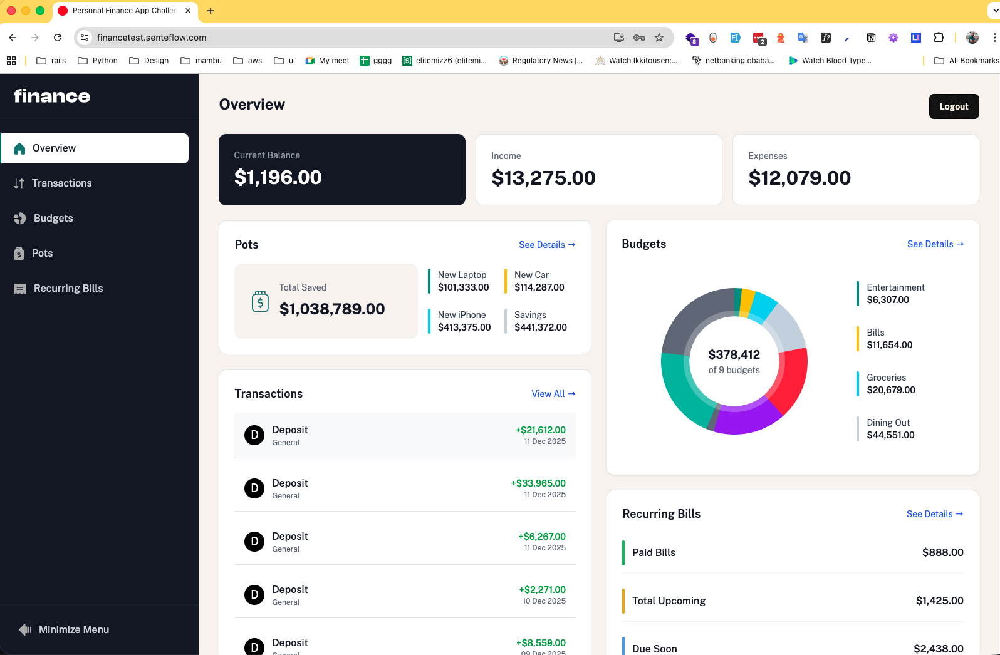
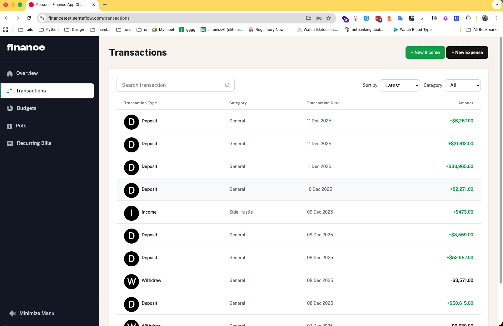
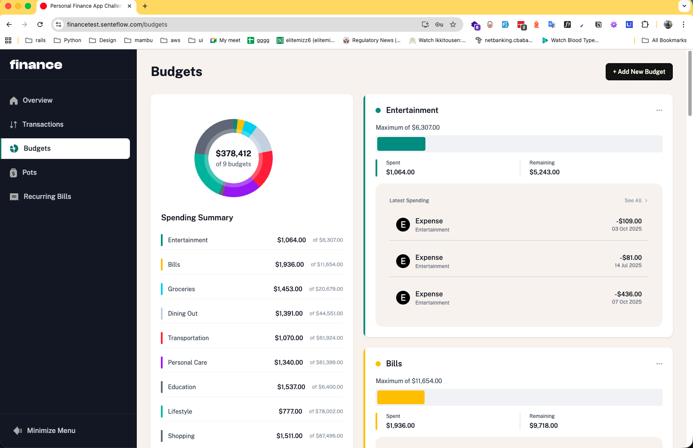
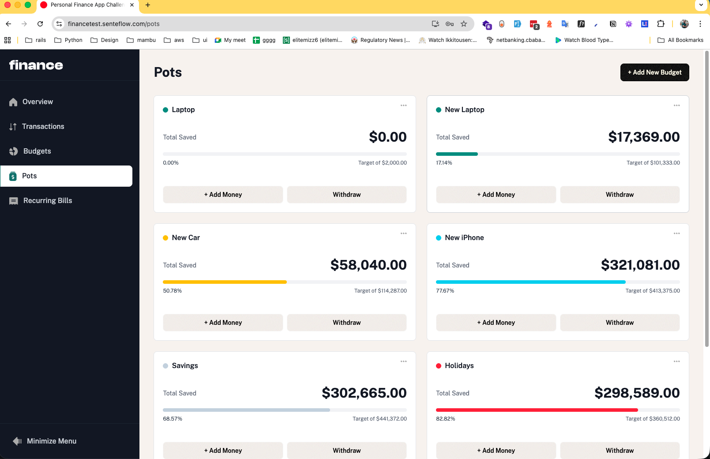
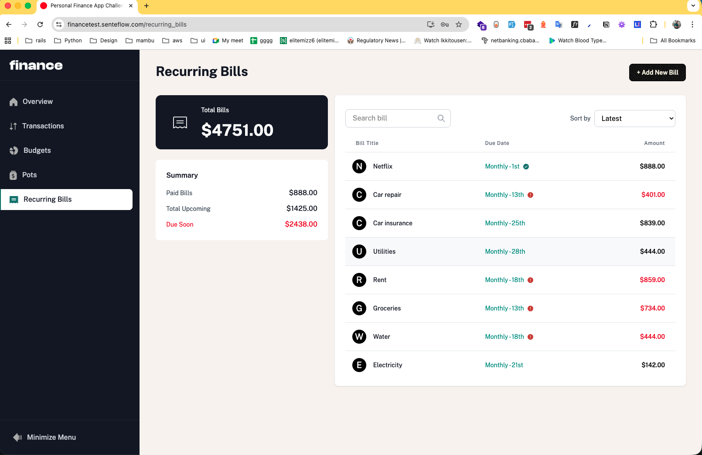
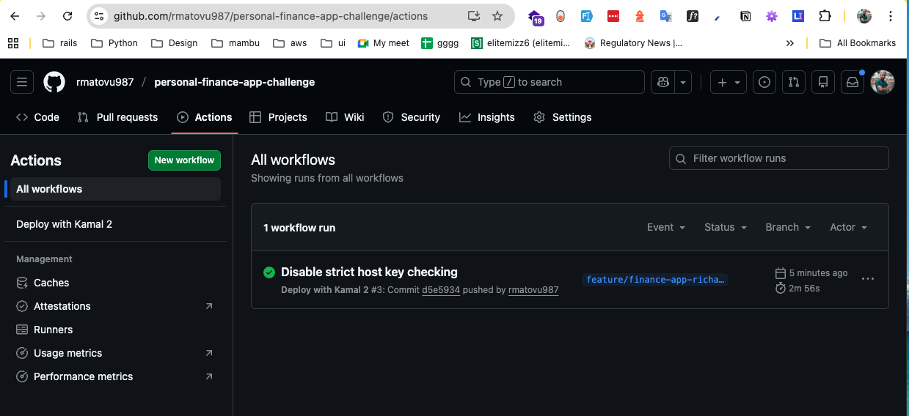

# **Finance App – Personal Budgeting & Expense Tracking**

A simple personal-finance application built with Ruby on Rails 8, designed to help users manage budgets, track expenses, and visualize spending using charts and dashboards.

------------------------------------------------------------------------

## 🚀 **Live Demo**

The app is deployed on Hetzner using Kamal 2.\
In addition, a Github Action is set up to continuously deploy the app when changes are pushed to the `feature/finance-app-richard` branch.

The link is: [https://financetest.senteflow.com](https://financetest.senteflow.com)

------------------------------------------------------------------------

## 📸 **Screenshots**

The screenshots are found in `docs/screenshots`.








------------------------------------------------------------------------

## 📦 **Tech Stack**

-   Ruby 3.4.5
-   Rails 8.1.1
-   PostgreSQL
-   TailwindCSS
-   Bun
-   Rails Auth
-   RSpec
-   Solid Queue

------------------------------------------------------------------------

## 🧰 **Setup Instructions**

### Clone repository

``` bash
git clone https://github.com/trekab/personal-finance-app-challenge.git
cd personal-finance-app-challenge
```

### Install dependencies

``` bash
bundle install
bun install
```

### Database setup

``` bash
bin/rails db:create db:migrate db:seed
```

### Run app

``` bash
bin/dev
```

------------------------------------------------------------------------

## 🧪 **Run Tests**

``` bash
bundle exec rspec
bundle exec rspec --format documentation --out spec_report.txt
```

------------------------------------------------------------------------

## ✍️ Author

Richard F. Matovu\
Senior Software Engineer
